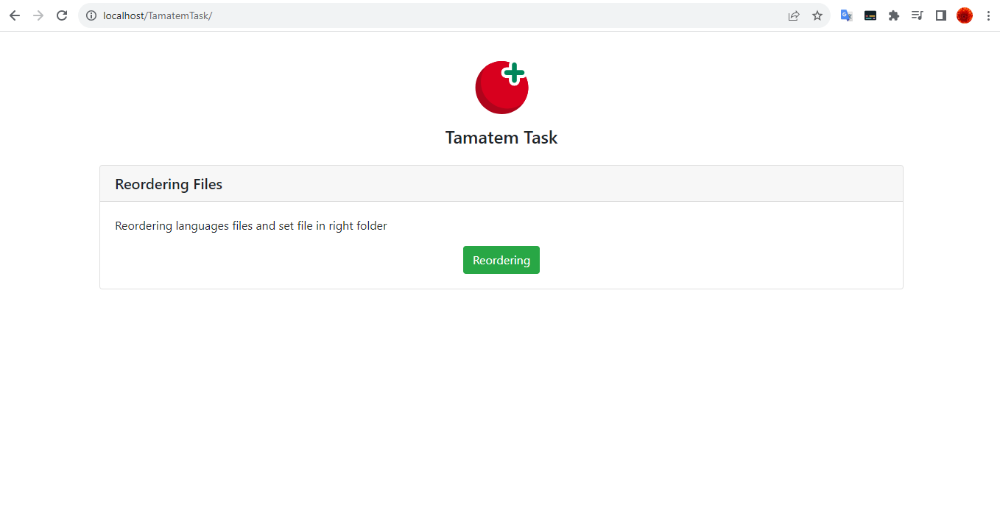

# Technical Assignment (TAMATEM GAME)



<p align="center">
  <b>
   This project reordering the languages files and group them into sub-folders , each sub-folder to be named with its common language name.      </b>
</p>

## Features

- **Object-Oriented PHP**: Learn how to structure your code using object-oriented programming (OOP) principles for improved maintainability and code organization.
- **MVC Design Pattern**: Understand and implement the Model-View-Controller (MVC) design pattern to separate concerns and achieve better code structure.
- **Apply SOLID Principles**: The overall goal of SOLID principles is to reduce dependencies so that engineers can change one area of the software without affecting others. In addition, they are intended to make designs easier to understand, maintain and extend.

---
## Requirements

To run Technical Assignment , make sure you have the following:
- Wamp or Xampp installed and configured.
- PHP 7.4 or newer.

---

## Run from web server

To run Technical Assignment on web server, follow these steps:
1. Go to htdocs folder or www folder
2. Run the following command to clone the repository: `git clone https://github.com/halawani12/g_t_task.git`
3. From borwser go to : http://localhost/g_t_task/

---

## Run using command line

To run Technical Assignment on your computer, follow these steps:
1. Go to htdocs folder or www folder
2. Run the following command to clone the repository: `git clone https://github.com/halawani12/g_t_task.git`
3. Run the following command to reorder files:
```bash
php Actions/LangFiles/ReorderingFilesAction.php
```

---

## Notes

- Languages files exist in public/files/LangFiles


